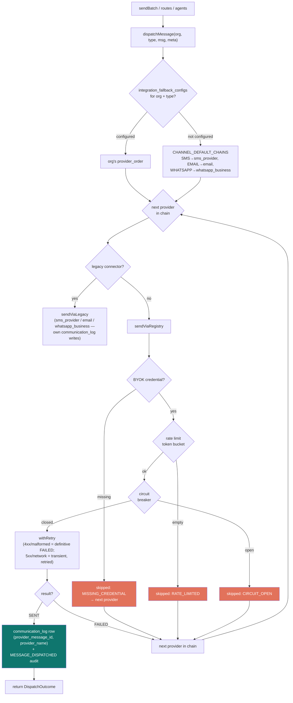
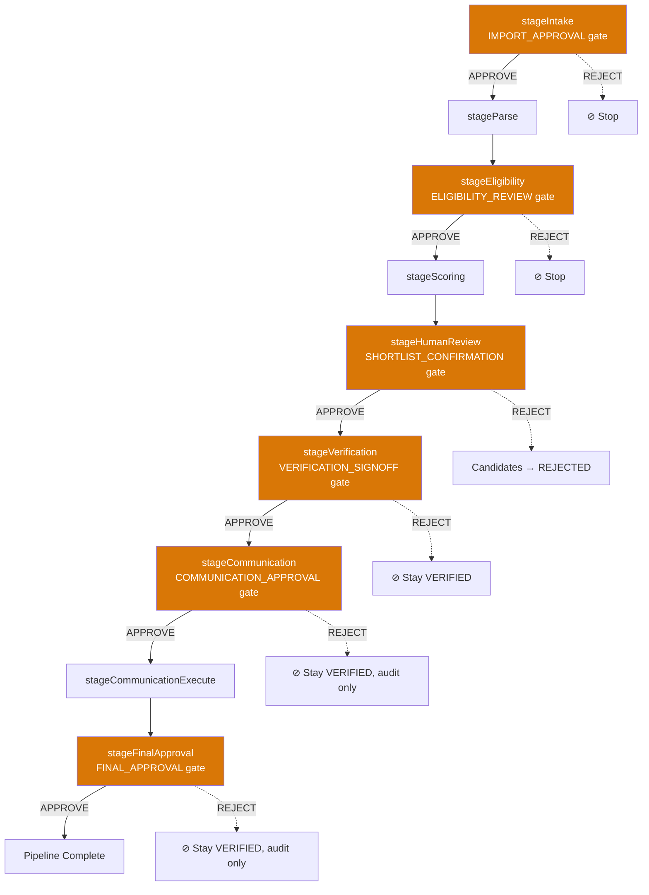
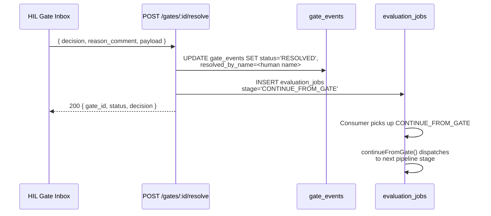
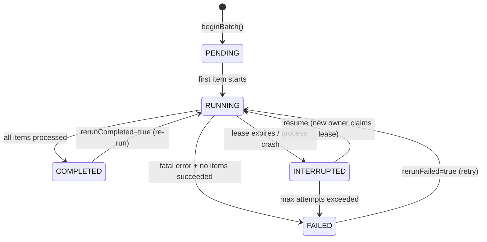
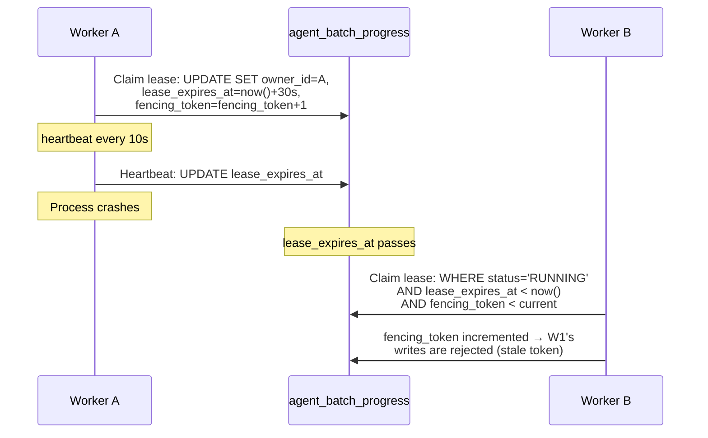
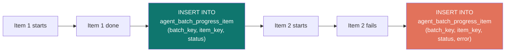

# Architecture

## Integration Registry & Communication Dispatcher (Quest 04)

Every outbound message and connector invocation flows through one path: the communication dispatcher (`src/services/communication/dispatcher.ts`). Every provider integration lives behind a uniform adapter contract (`Integration<TConfig, TInput, TOutput>`) in `src/services/integrations/` — 31 adapters across SMS, VOIP, email, WhatsApp, bdjobs, LinkedIn, calendar, Teletalk, and interface-only messaging, registered centrally and idempotently by `register_all.ts` at every boot entrypoint.

Key invariants:

- **Single source of truth**: `CONNECTOR_TO_ADAPTER` in `src/services/integrations/_base/registry.ts` maps every DB connector name to its adapter (30 names → 31 adapters).
- **No silent failures**: every attempt outcome lands in `communication_log` (registry path writes provider-tracked rows; the legacy bridge delegates to connectors that log their own rows) and the audit trail (`MESSAGE_DISPATCHED` / `MESSAGE_DISPATCH_FAILED`).
- **BYOK only**: adapters receive `baseUrl`/`apiKey` from the org's `api_credentials` row and never branch on `NODE_ENV` or fall back to defaults; missing credentials throw `MissingCredentialError` (the dispatcher treats it as a skipped provider, not a crash).
- **Definitive vs transient**: adapter-level 4xx/malformed responses return `FAILED` (move to next provider); 5xx/network errors throw (retried with backoff first).
- **Templates are authored, not improvised**: `template_bodies.ts` holds human-authored en/bn bodies per `CommunicationTemplateCode`; strict `{{key}}` interpolation; an unauthored code throws loudly.
- **Interface-only adapters** (`free_framework`, `telegram`, `viber`, `signal`) throw `ProviderNotImplementedError` on send per the Rule 18 exception — documented contract, registry entry, asserting test.

## Gate-Driven Pipeline Lifecycle

The UROS evaluation pipeline is a chain of asynchronous queue jobs connected by human-in-the-loop gates. No stage blocks a worker — each gate creates a durable `PENDING` row and returns; resolution enqueues a `CONTINUE_FROM_GATE` job that resumes the pipeline.

### Gate Resolution Flow

## Batch Checkpoint Lifecycle

### Lease & Fencing Token Protocol

### Per-Item Checkpoint (O(1) Writes)

Recovery reads `agent_batch_progress_item WHERE batch_key = $1` to rebuild `alreadyProcessedKeys` in O(n) — no JSONB array parsing, no write amplification.
